<p align="center">
  
  <h1 align="center">YourSSH</h1>
  <p align="center">
    <a href="LICENSE"></a>
    <a href="https://flutter.dev"></a>
    <a href="https://github.com/YoursshLabs/yourssh/releases"></a>
    <a href="https://github.com/YoursshLabs/yourssh/releases"></a>
    <a href="https://github.com/YoursshLabs/yourssh/actions"></a>
    <a href="https://github.com/YoursshLabs/yourssh/pulls"></a>
  </p>
</p>

A professional, open-source SSH client for **macOS**, **Windows**, and **Linux** built with Flutter. Designed for developers and sysadmins who want a fast, keyboard-friendly terminal experience with built-in SFTP, port forwarding, and secure credential management — all in a clean dark UI.

---

## Download

Get the latest release from the [Releases page](https://github.com/YoursshLabs/yourssh/releases).

YourSSH also checks for new releases on launch and from **Settings → Updates**; when a newer version is available it shows a banner and can download the right build for your OS and open the installer for you. Because the app is not code-signed, this is an assisted flow (it never silently replaces itself); if no matching build exists for your platform it opens the Releases page instead.

| Platform | File |
|---|---|
| macOS (Apple Silicon) | `YourSSH-x.x.x-macOS-arm64.dmg` |
| Windows (x64) | `YourSSH.Setup.x.x.x-Windows-x64.exe` |
| Windows (ARM64 — Surface, Snapdragon) | `YourSSH.Setup.x.x.x-Windows-arm64.exe` |
| Linux (Debian/Ubuntu — x86_64) | `yourssh_x.x.x_amd64.deb` |
| Linux (Debian/Ubuntu — ARM64) | `yourssh_x.x.x_arm64.deb` |

### macOS — First Launch

macOS may block the app on first open because it is not yet notarized with Apple. To open it:

1. **Right-click** (or Control-click) the app → **Open**
2. Click **Open** in the dialog that appears

You only need to do this once. After that, the app opens normally.

Alternatively, run this in Terminal:
```bash
xattr -dr com.apple.quarantine /Applications/YourSSH.app
```

### Windows — Installation

Run the `.exe` installer and follow the setup wizard. The installer adds YourSSH to the Start menu and optionally the desktop.

> **Windows SmartScreen** may warn on first run because the app is not yet code-signed. Click **More info → Run anyway** to proceed.

If you prefer a portable version (no installation required), download `YourSSH-x.x.x-Windows-arm64.exe` (ARM64) or extract the x64 build manually from the installer.

### Linux — Installation

**Debian / Ubuntu (recommended):**
```bash
sudo dpkg -i yourssh_x.x.x_amd64.deb   # x86_64
sudo dpkg -i yourssh_x.x.x_arm64.deb   # ARM64 (Raspberry Pi 4/5, Apple M1 Linux, etc.)
```

After install, launch from your application menu or run `yourssh` in a terminal.

**Uninstall:**
```bash
sudo dpkg -r yourssh
```

> **Minimum requirement:** GTK3 runtime (pre-installed on Ubuntu 20.04+, Debian 11+, and most modern distros).

---

## Features

### Terminal & Connectivity
- **Multi-tab SSH sessions** with named tabs and per-tab connection state
- **Terminal sharing (multiplayer)** — share a live SSH session with a session code; guests join via the Command Palette and watch or interact in real time; built on Supabase Realtime
- **Split terminal view** — horizontal/vertical pane splitting within a session
- **Search-in-scrollback (Cmd/Ctrl+F)** — regex-powered search across the full terminal buffer; highlights all matches, navigate with Enter / Shift+Enter
- **Shell integration (bash/zsh)** — injected OSC 7/133 prompt hooks surface the working directory on the session tab, a per-command status gutter (green = ok, red = failed), jump-to-prompt (Cmd/Ctrl+↑/↓), and cwd-aware path completion in the input bar; auto-on with per-host / global opt-out; the setup script is delivered invisibly (never echoed into your terminal or recordings)
- **Port forwarding** — local, remote, and dynamic SOCKS5 tunnels
- **Jump host / bastion proxy** — connect to internal servers via a bastion host; select any saved host as the jump hop in the host detail panel
- **Local shell** — spawn native macOS/Windows/Linux shell alongside SSH sessions
- **xterm-256color** terminal emulation with full PTY support

### File Management
- **Dual-panel SFTP** — browse local and remote filesystems side-by-side
- Upload, download, rename, delete files and directories with transfer progress
- **Sudo SFTP (root file transfers)** — per-host SFTP mode that runs the whole SFTP session as root through `sudo` (WinSCP-style), with distro auto-detection and clear error guidance
- **View & Open with…** — read-only file preview, plus a hover submenu listing every installed app that can open the file's type; external edits are watched and auto-uploaded back to the server
- Breadcrumb navigation and file type icons

### Credentials & Security
- **4 auth methods**: password, SSH private key, SSH certificate (CA-signed), SSH agent (`SSH_AUTH_SOCK` on macOS/Linux; `\\.\pipe\openssh-ssh-agent` on Windows 10+)
- **OS-level secure storage**: credentials encrypted in macOS Keychain / Windows Credential Manager via `flutter_secure_storage`
- **Known hosts verification**: interactive fingerprint trust dialog on first connect; persistent known-hosts database
- **Zero-knowledge cloud sync**: host configs encrypted client-side (AES-256-GCM) with a 12-character sync code that never leaves your devices — the Supabase anon key alone cannot decrypt anything
- **P2P QR sync**: transfer all hosts and passwords to another device via QR code over LAN or Tailscale — no cloud required

### Productivity
- **Command Palette (Cmd/Ctrl+K)** — fuzzy-search all hosts, navigation sections, snippets, and app actions from a single keyboard shortcut
- **Workspace persistence** — open SSH tabs, layout, and active session automatically restored on relaunch; no need to reconnect after restart
- **Command snippets** — save and inject reusable command templates; a collapsible snippets panel inside the terminal lets you browse, search, copy, and run them against the active pane
- **Command history** — searchable history per session
- **Hotkeys** — customizable global keyboard shortcuts
- **Host groups** — organize connection profiles into logical folders
- **Broadcast mode** — send the same input to multiple sessions at once
- **Code editor** — edit remote files inline with a Monaco-powered editor
- **Session recording** — record terminal output to Asciinema v2 (`.cast`) files; per-host auto-record setting; manual start/stop from the toolbar; Recording Library with in-app playback (play/pause, speed control 0.5×–5×)

### Design
- Dark-only interface with a cohesive green-accent palette
- **35 terminal color themes** with a visual picker (Dracula, Solarized, Gruvbox, One Dark, Nord, and more)
- 7 bundled monospace fonts: 6 Powerline-compatible (DejaVu, Inconsolata, Meslo LGS, Source Code Pro, Ubuntu Mono, Roboto Mono) + MesloLGS NF (Nerd Font)
- Network stats overlay — real-time traffic counter widget per session
- Minimum window size enforced (800×600); fully resizable

### DevOps & Developer Tools
- **Containers (Docker / Kubernetes)** — list running containers (`docker ps`) and pods (`kubectl get pods`) on the active SSH session, then **Exec** into any of them in a new terminal tab; namespace filter + all-namespaces toggle for Kubernetes, and an install/permission hint when the runtime is missing
- **Network Tools** — ping, cURL, DNS lookup, traceroute, port scan, whois, netstat, disk usage, memory info, HTTP headers, SSL certificate inspection — all run on the active SSH session
- **Cloudflare Tunnel manager** — start/stop quick tunnels via `cloudflared` on the remote host; public URL displayed instantly
- **LAN Share** — serve any local file over HTTP for one-click download on the same network
- **Mail Catcher** — spin up a local SMTP capture server via SSH; inspect emails in a built-in two-panel viewer
- **MCP Server Gateway** — run an MCP server on a remote host and forward it locally for AI tool access
- **S3 Browser** — browse, upload, and delete objects in any S3-compatible bucket (AWS, MinIO, Cloudflare R2, etc.)
- **AI Chat Sidebar** — toggle an AI assistant sidebar for command help and debugging; supports **Anthropic Claude**, **OpenAI**, and **Google Gemini** with configurable model selection

### Plugin System
- **Plugin API** (`yourssh_plugin_api`) — stable Dart interface for compiled (Dart) plugins; exposes SSH session proxy, secure prefs, navigation slots, and config UI hooks
- **Script Engine** (`yourssh_script_engine`) — disk-based JS plugin runtime via QuickJS (Dart FFI); plugins live in a directory as `plugin.json` + JS files; hot-reload on file change; no app rebuild required
- **HookBus** — typed event bus that routes `terminal.output`, `terminal.input`, and session lifecycle events to registered JS hooks (transform, intercept, observe)
- **Bridges** — JS plugins call `ssh.*`, `sftp.*`, `storage.*`, and `ui.*` APIs bridged to native Dart
- **PermissionGuard + circuit breaker** — plugins must declare permissions in manifest; error circuit-breaker auto-disables misbehaving plugins
- **Plugin Manager & Console** — in-app screen to enable/disable JS plugins, reload them, and inspect their `console.log` output
- **YourSSH DevOps plugin** (`yourssh_devops`) — reference Dart plugin bundling S3 Browser and LAN Share as plugin-provided nav sections

---

## Screenshots

<table>
  <tr>
    <td align="center"><b>Home — Host List</b><br/>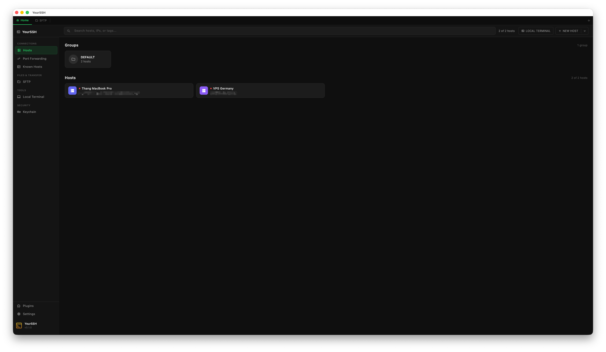</td>
    <td align="center"><b>SSH Terminal with AI Assistant</b><br/>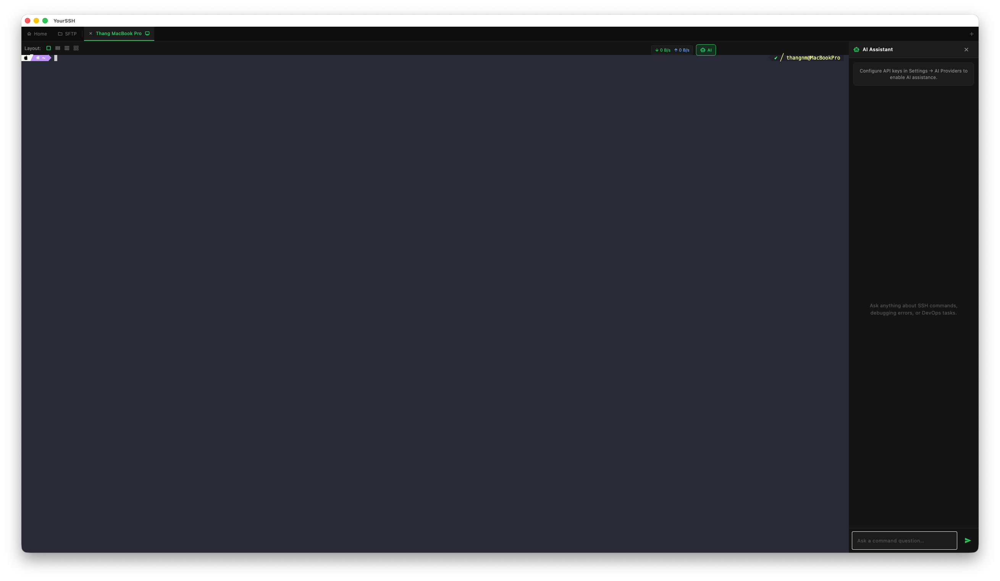</td>
  </tr>
  <tr>
    <td align="center"><b>SFTP File Browser</b><br/>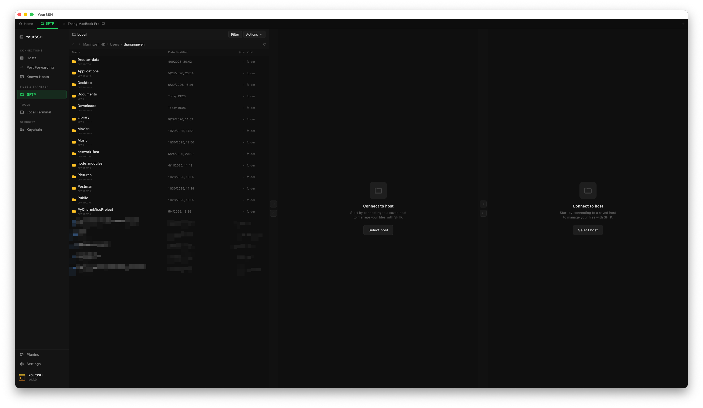</td>
    <td align="center"><b>Plugins</b><br/>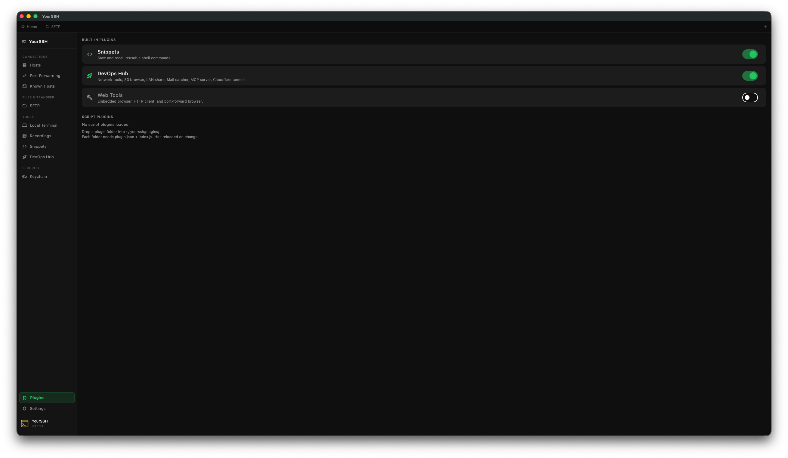</td>
  </tr>
  <tr>
    <td align="center"><b>DevOps Hub — Network Tools</b><br/>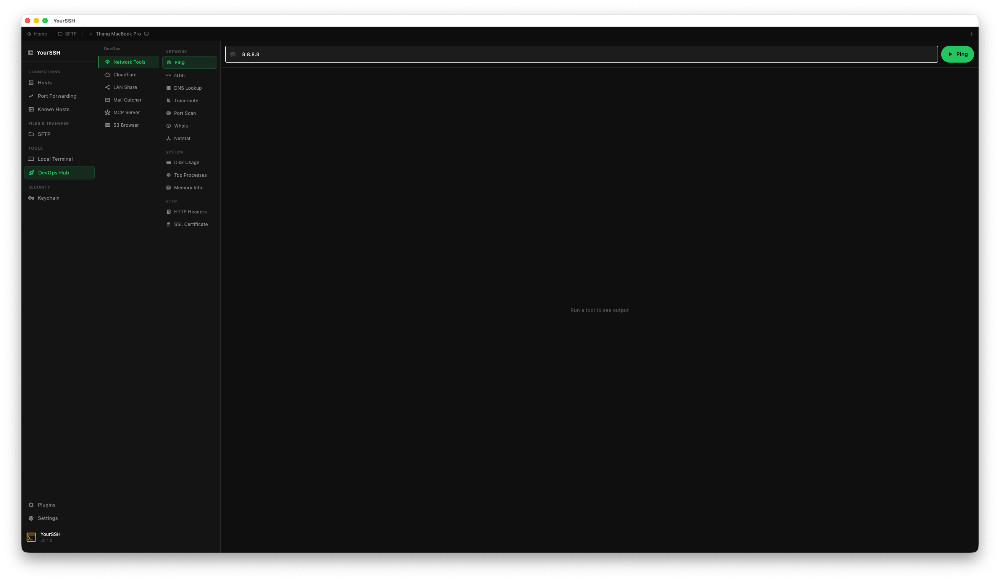</td>
    <td align="center"><b>Web Tools — HTTP Client</b><br/>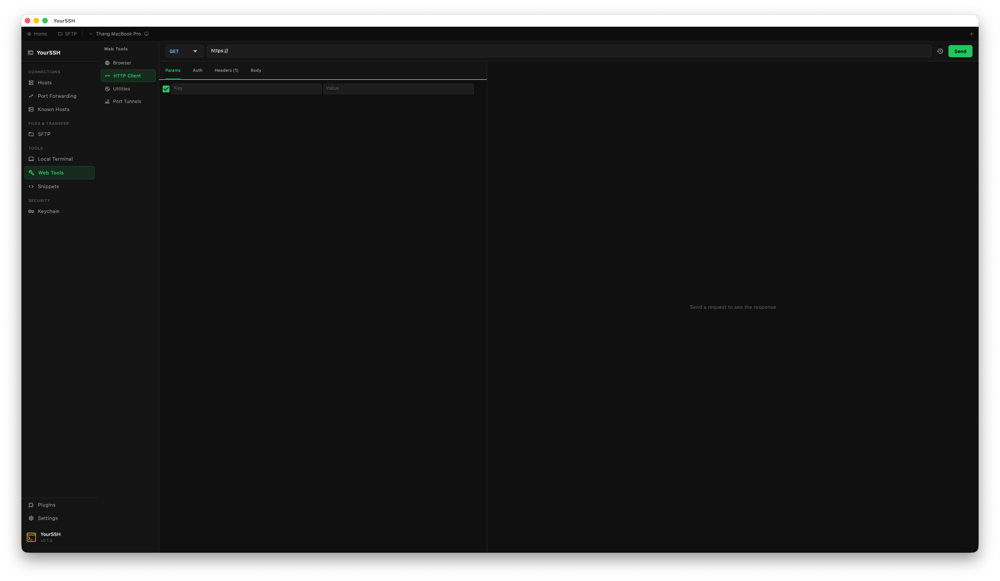</td>
  </tr>
  <tr>
    <td align="center"><b>Snippets</b><br/>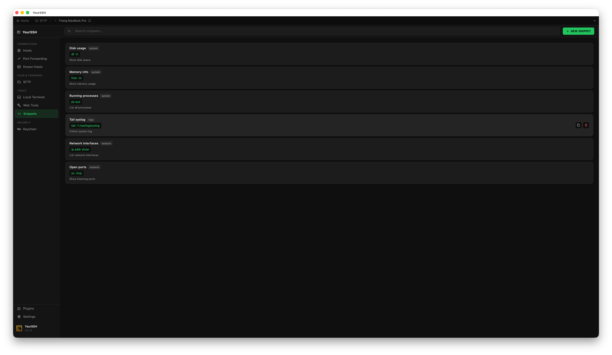</td>
    <td align="center"><b>Settings — Sync</b><br/>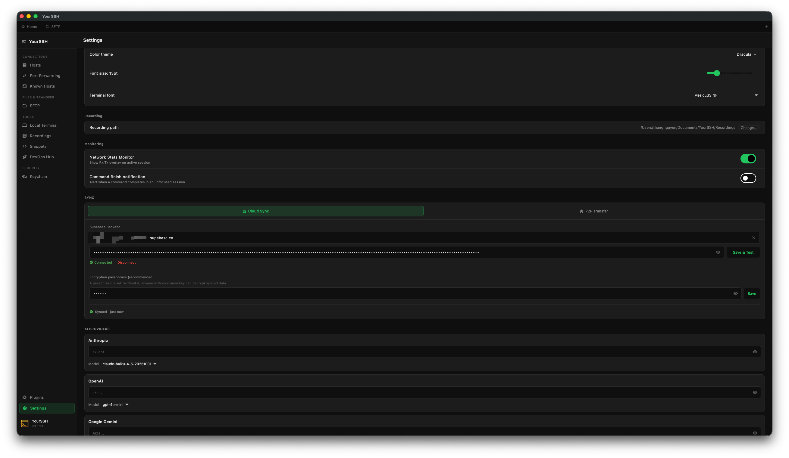</td>
  </tr>
  <tr>
    <td align="center"><b>P2P QR Sync — Export via QR</b><br/>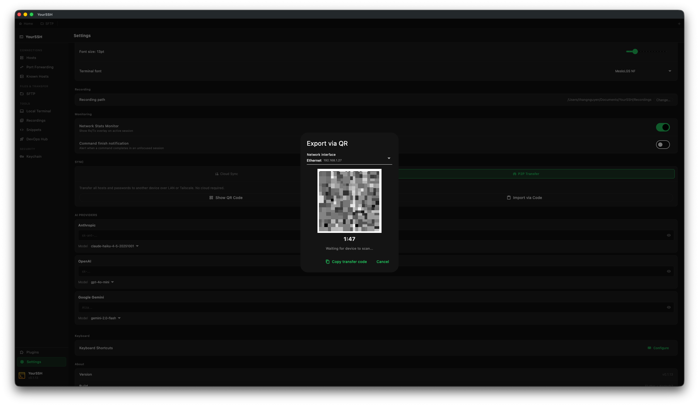</td>
    <td align="center"><b>Session Recording &amp; Playback</b><br/>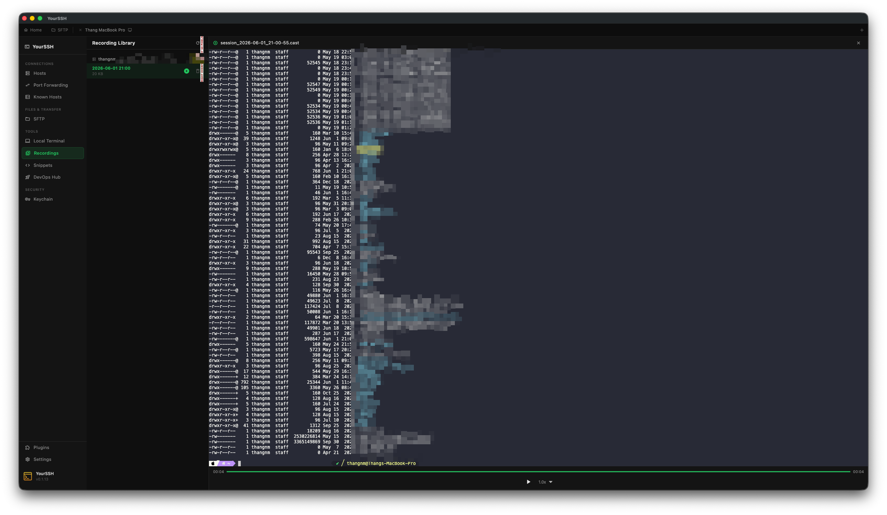</td>
  </tr>
  <tr>
    <td align="center"><b>Terminal Sharing (Multiplayer)</b><br/>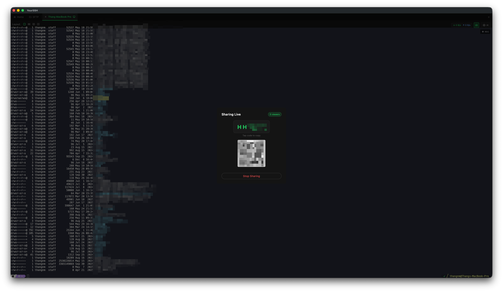</td>
    <td align="center"><b>Settings — Terminal Themes</b><br/>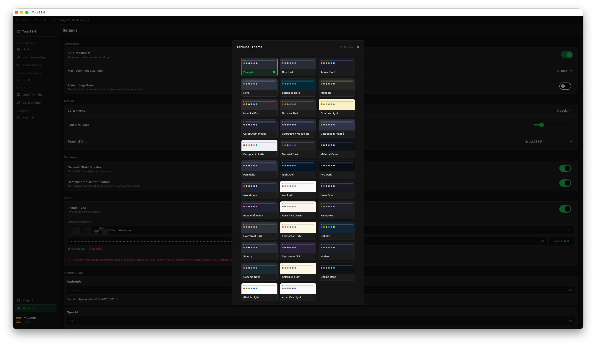</td>
  </tr>
</table>

---

## Tech Stack

| Layer | Technology |
|---|---|
| UI Framework | Flutter (Material 3, dark theme) |
| State Management | `provider` (ChangeNotifier) |
| SSH / SFTP / Port Forwarding | `dartssh2` (local fork with `signAsync`) |
| Terminal Emulation | `xterm` (local fork — Windows text-input viewId fix) |
| Local PTY | `flutter_pty` (local fork — Windows command-line fix) |
| Secure Storage | `flutter_secure_storage` |
| Cloud Sync Backend | `supabase_flutter` |
| Encryption | `cryptography` (AES-GCM, HKDF), `crypto` (AWS Sig V4) |
| Code Editor | Monaco editor via `webview_flutter` |
| Window Control | `window_manager`, `hotkey_manager` |
| Local Persistence | `shared_preferences`, `file_picker` |
| HTTP Server | `shelf` (LAN Share) |
| Network Info | `network_info_plus` |
| Markdown Rendering | `flutter_markdown` (AI chat) |
| S3 XML Parsing | `xml` |
| QR Code | `qr_flutter`, `mobile_scanner` (P2P sync) |
| JS Plugin Runtime | QuickJS via Dart FFI (`yourssh_script_engine`) |

---

## Requirements

| Platform | Minimum Version |
|---|---|
| macOS | 10.14 Mojave |
| Windows | Windows 10 (64-bit) |
| Linux | Ubuntu 20.04+ / any GTK3-compatible distro |
| Flutter SDK | 3.12.0+ |
| Dart SDK | 3.12.0+ |

---

## Getting Started

### 1. Clone the repository

```bash
git clone https://github.com/YoursshLabs/yourssh.git
cd yourssh
```

### 2. Install Flutter dependencies

```bash
cd app
flutter pub get
```

### 3. Run in development

```bash
# macOS
flutter run -d macos

# Windows
flutter run -d windows

# Linux
flutter run -d linux
```

### 4. Build a release binary

```bash
# macOS
flutter build macos

# Windows
flutter build windows

# Linux
flutter build linux
```

### 5. Lint & analyze

```bash
flutter analyze
```

### 6. Run tests

```bash
flutter test
# Single file
flutter test test/widget_test.dart
```

---

## Project Structure

```
yourssh/
├── app/                          # Flutter application (active codebase)
│   ├── lib/
│   │   ├── main.dart             # Entry point — bootstraps all providers
│   │   ├── models/               # Plain data classes
│   │   ├── providers/            # ChangeNotifier state managers
│   │   ├── services/             # Business logic & external integrations
│   │   ├── screens/              # Top-level screen (main_screen.dart)
│   │   ├── plugins/              # Plugin registry and context implementation
│   │   ├── widgets/              # UI components
│   │   │   └── web_tools/        # Embedded browser, HTTP client, utility tools
│   │   └── theme/                # Dark theme definition (app_theme.dart)
│   ├── assets/
│   │   ├── monaco_editor.html    # Bundled Monaco editor for remote file editing
│   │   ├── app_icon.png
│   │   └── fonts/
│   │       ├── powerline/        # 6 Powerline-compatible monospace fonts
│   │       └── nerd/             # MesloLGS NF (Nerd Font, 4 variants)
│   ├── macos/                    # Flutter macOS runner (Xcode entitlements, Info.plist)
│   ├── windows/                  # Flutter Windows build configuration
│   ├── linux/                    # Flutter Linux build configuration (CMake)
│   └── pubspec.yaml
│
├── packages/
│   ├── yourssh_plugin_api/       # Plugin interface package (stable public API)
│   ├── yourssh_script_engine/    # JS plugin runtime (QuickJS FFI, HookBus, bridges)
│   ├── yourssh_devops/           # DevOps plugin (S3, LAN Share)
│   ├── dartssh2/                 # Local fork — adds signAsync() for SSH agent auth
│   ├── flutter_pty/              # Local fork — Windows argv[0] duplication fix (local terminal input)
│   └── xterm/                    # Local fork — passes viewId to TextInput (Windows typing fix)
├── macos/                        # Xcode project files (xcodegen — project.yml)
├── supabase/migrations/          # Database schema migrations
├── scripts/                      # Build and release automation
├── Makefile                      # Xcode project generation targets
└── CLAUDE.md                     # AI assistant context for this repo
```

---

## Architecture

```
Flutter UI (widgets / screens)
  └── Providers (ChangeNotifier via provider package)
        └── Services (business logic)
              └── dartssh2              — SSH, SFTP, port forwarding
              └── flutter_pty           — local PTY shell
              └── flutter_secure_storage — OS credential vault
              └── shared_preferences    — host list, app settings
              └── supabase_flutter      — optional encrypted sync
              └── shelf                 — local HTTP server (LAN Share)
```

### Key Providers

| Provider | Responsibility |
|---|---|
| `HostProvider` | CRUD for saved SSH connection profiles, persisted via `StorageService` |
| `SessionProvider` | Lifecycle of active `SshSession` objects; auto-reconnect logic |
| `LocalSessionProvider` | Lifecycle of local PTY shell sessions |
| `KeyProvider` | SSH key entries (path + passphrase + optional CA certificate) |
| `KnownHostsProvider` | Host fingerprint trust database |
| `PortForwardProvider` | Tunnel configuration and active forward tracking |
| `TunnelProvider` | Cloudflare and MCP gateway tunnel state |
| `SnippetProvider` | Reusable command snippets |
| `CommandHistoryProvider` | Per-session command history |
| `SettingsProvider` | App-wide config (tmux, auto-reconnect, hotkeys, theme) |
| `SyncProvider` | Cloud sync state; delegates to `SyncService` |
| `SftpPanelProvider` | SFTP panel state (current path, selection, loading) |
| `SftpTransferProvider` | Active transfer queue and progress tracking |
| `LocalFilePanelProvider` | Local filesystem panel state for dual-panel SFTP |
| `TerminalLayoutProvider` | Split-terminal layout (horizontal/vertical panes) |
| `AiChatProvider` | AI chat sidebar — multi-provider (Anthropic, OpenAI, Gemini) |
| `PluginProvider` | Installed plugins, enable/disable state, config slot wiring |
| `UpdateProvider` | In-app update check (GitHub releases) + download/install orchestration; drives the banner and Settings section |

### Key Services

| Service | Responsibility |
|---|---|
| `SshService` | Owns `SSHClient` and `SSHSession` maps; connect, exec, shell, SFTP, disconnect |
| `StorageService` | Hosts as JSON in `SharedPreferences`; passwords/passphrases in secure storage |
| `SyncService` | Encrypts host list and pushes/pulls from Supabase |
| `SyncEncryption` | AES-GCM encrypt/decrypt for sync data |
| `SupabaseService` | Supabase HTTP wrapper (upsert/fetch/delete in `sync_data` table) |
| `LocalShellService` | Spawns native PTY sessions on macOS/Windows/Linux |
| `PtyRunner` | Low-level PTY wrapper used by `LocalShellService` |
| `SftpFileOpsService` | SFTP file operations (copy, move, rename, delete) |
| `SftpTransferService` | Chunked SFTP upload/download with progress callbacks |
| `CloudflareTunnelService` | Start/stop `cloudflared` quick tunnels on the remote host |
| `LanShareService` | HTTP file server on LAN via `shelf` |
| `MailCatcherService` | Local SMTP capture server via SSH port forward |
| `McpGatewayService` | Forward MCP server from remote host to local port |
| `S3Service` | S3-compatible bucket operations with AWS Signature V4 |
| `NetworkStatsService` | Real-time network traffic stats for the overlay widget |
| `WebToolsService` | Runs network diagnostic commands on the active SSH session |
| `HotkeyService` | Register and dispatch global keyboard shortcuts |
| `SystemAgentProxy` | SSH agent bridge: Unix socket (`SSH_AUTH_SOCK`) on macOS/Linux, named pipe (`\\.\pipe\openssh-ssh-agent`) on Windows |
| `CertificateKeyPair` | OpenSSH CA-signed certificate auth (`id_rsa-cert.pub`) |
| `P2PSyncService` | One-shot LAN HTTP server + client for QR-based P2P host transfer |
| `P2PSyncEncryption` | AES-256-GCM encrypt/decrypt with raw random key (no PBKDF2) for P2P sync |
| `UpdateService` | Checks GitHub `releases/latest`, compares semver, picks the OS/arch artifact, downloads with progress, launches the OS installer |

### Plugin System

Two plugin types coexist:

**Dart plugins** (compiled-in): implement `YourSSHPlugin` from `packages/yourssh_plugin_api`; registered in `app/lib/plugins/plugin_registry.dart` at build time. `PluginProvider` manages enable/disable. `YourSSHDevOpsPlugin` is the reference implementation.

**JS plugins** (disk-based, runtime): powered by `packages/yourssh_script_engine`. A plugin is a directory containing `plugin.json` (manifest with name, permissions, hook declarations) + one or more `.js` files. `ScriptEngineService` loads them via `QuickJsRuntime` (Dart FFI → QuickJS C engine) — no rebuild required. `PluginLoader` watches the directory for changes and hot-reloads modified plugins. `PluginEngineProvider` surfaces the loaded plugins to the UI.

---

## Sync Setup (Optional)

YourSSH supports two ways to sync hosts between devices:

### Cloud Sync (Supabase)

Continuous sync via a Supabase backend. All data is **encrypted client-side** before leaving your machine.

1. Create a free project at [supabase.com](https://supabase.com).
2. Run the migrations in `supabase/migrations/` against your project.
3. Add your Supabase URL and anon key in **Settings → Sync** inside the app.
4. Generate a **sync code** on your first device, then enter the same code on your other devices. The code is the encryption key — without it the synced data cannot be read.

### P2P QR Sync (no cloud required)

One-time transfer from one device to another over LAN or Tailscale:

1. On Device A: open **Settings → Sync → Show QR Code** (or click the QR icon in the host list).
2. Select your network interface (WiFi, Tailscale, Ethernet).
3. On Device B: open **Settings → Sync → Scan QR Code** and point the camera at the code.
4. All hosts and passwords are transferred, encrypted end-to-end with AES-256-GCM.

> Both sync methods are fully optional. The app works entirely offline without either.

---

## Contributing

Contributions are welcome. Here's the recommended workflow:

### 1. Fork and branch

```bash
git checkout -b feat/your-feature-name
```

### 2. Follow the existing patterns

- **Models** in `app/lib/models/` — immutable data classes with `copyWith`.
- **Providers** in `app/lib/providers/` — extend `ChangeNotifier`, delegate I/O to services.
- **Services** in `app/lib/services/` — pure logic, no Flutter widget dependencies.
- **Widgets** in `app/lib/widgets/` — stateless where possible; use `Consumer`/`context.watch` to bind to providers.
- **Plugins** in `packages/` — implement `YourSSHPlugin`; use `PluginContext` for SSH and storage access.

### 3. Code style

- Run `flutter analyze` — zero warnings expected before submitting.
- Keep comments minimal; prefer self-documenting names.
- Avoid adding dependencies unless essential.

### 4. Test your changes

```bash
flutter test
flutter analyze
```

### 5. Open a pull request

Include a short description of **what** changed and **why**. Screenshots for UI changes are appreciated.

---

## Roadmap

### ✅ Shipped

- [x] Custom terminal color themes (35 presets)
- [x] SSH certificate authentication (CA-signed certs)
- [x] SSH agent authentication (`SSH_AUTH_SOCK`)
- [x] Linux desktop target
- [x] Plugin / extension system
- [x] Multi-provider AI assistant (Claude, OpenAI, Gemini)
- [x] P2P host sync via QR code (LAN / Tailscale, AES-256-GCM encrypted)
- [x] **Script Engine** — disk-based JS plugins via QuickJS FFI; HookBus; SSH/SFTP/Storage/UI bridges; hot-reload; permission guard + circuit breaker; consent dialog, manager screen, console log viewer

### ✅ Phase 1 — Quick wins

- [x] **SSH config import** — paste `~/.ssh/config` or JSON to bulk-import hosts
- [x] **Host import from CSV** — bulk import connection profiles from a spreadsheet
- [x] **Command finish notification** — system alert when a long-running command completes while the window is not focused

### 🔜 Phase 2 — Core SSH improvements

- [x] **Jump host / bastion proxy** — `ProxyJump` support for multi-hop connections
- [ ] **TOTP / keyboard-interactive 2FA** — OTP prompt for servers that require it after password
- [x] **Windows SSH agent (Pageant)** — named-pipe agent support alongside `SSH_AUTH_SOCK`

### 🔜 Phase 3 — Productivity

- [x] **Session recording** — save terminal sessions to file (asciinema format) with playback
- [x] **Multi-host scripting** — run a script or command across multiple selected hosts in parallel
- [x] **Smarter tab completion** — history-aware suggestions + remote filesystem path completion
- [ ] **Vault** — encrypted local store for API keys, tokens, and secrets with biometric unlock

### 🔜 Phase 4 — DevOps tooling

- [ ] **Docker / Kubernetes exec** — list containers/pods on the remote host and exec into them directly
- [ ] **Remote process manager** — `htop`-style process list with kill support
- [ ] **Log tail viewer** — real-time `tail -f` panel with regex filter and highlight

### 🔜 Phase 5 — Platform expansion

- [ ] **iOS / iPadOS target** (experimental)
- [ ] **Android target** (experimental)

---

## License

This project is licensed under the MIT License — see [LICENSE](LICENSE) for details.

---

## Acknowledgements

- [dartssh2](https://pub.dev/packages/dartssh2) — SSH protocol implementation for Dart
- [xterm.dart](https://pub.dev/packages/xterm) — Terminal emulator widget
- [flutter_pty](https://pub.dev/packages/flutter_pty) — PTY support for local shell
- [Supabase](https://supabase.com) — Open-source Firebase alternative used for sync backend
